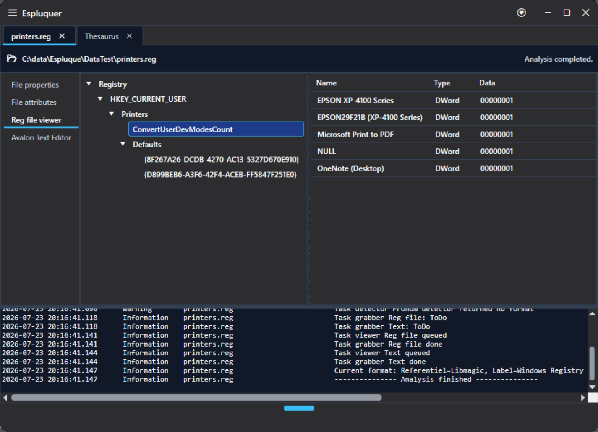
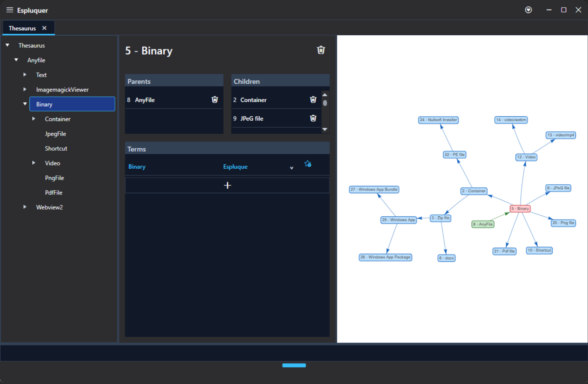
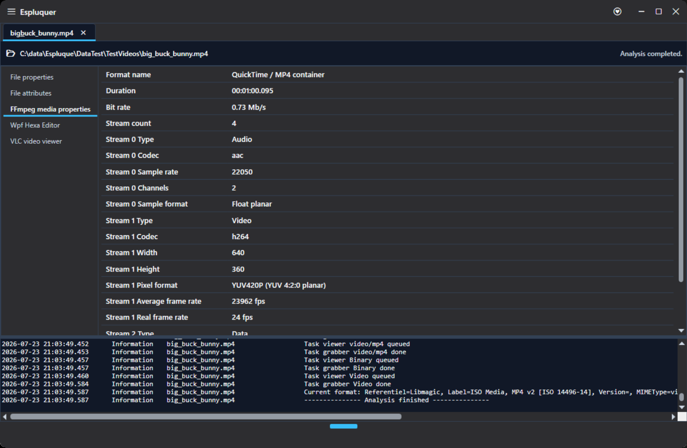
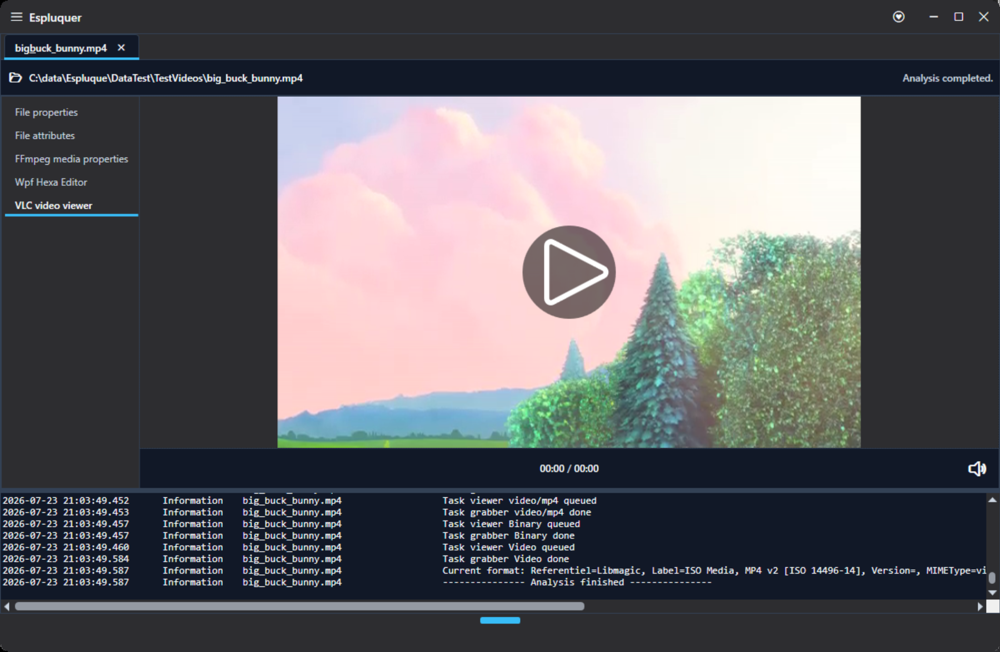
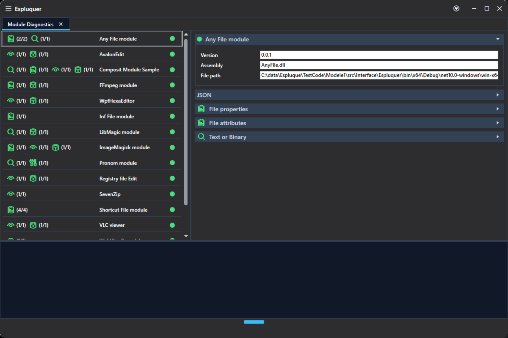
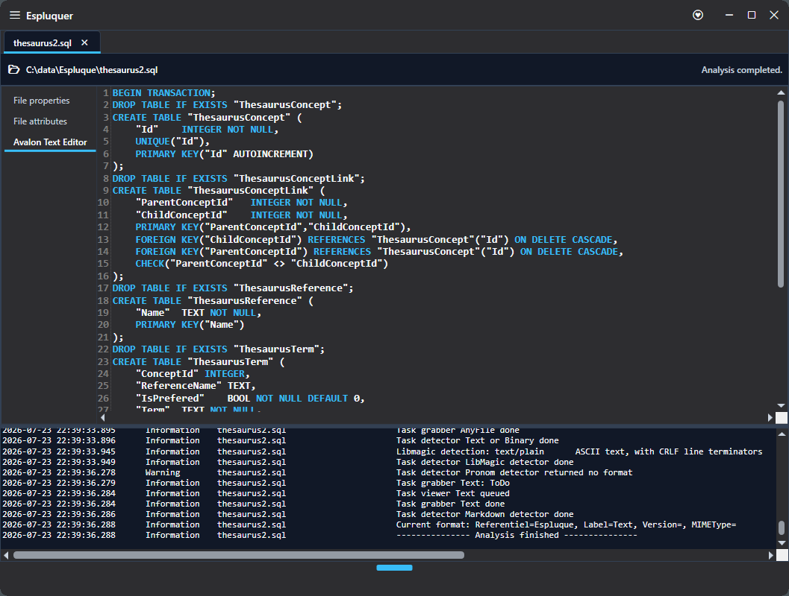

# Espluque
 
   

> A modular, thesaurus-driven file analysis engine built with WPF and .NET.

Espluque combines independent modules through a graph of concepts. A detector can directly identify a file format, regardless of the reference system it uses or its level of specificity. 
The engine maps this identification to the corresponding concept, then follows the graph relationships to continue the analysis and activate all associated contributions.

## Overview

Espluque is a modular desktop application for identifying, analyzing and displaying files through independent contributions such as detectors, grabbers and viewers. 
A thesaurus-driven engine connects these contributions and orchestrates the analysis according to the concepts associated with each file.

This repository is an architectural showcase focused on runtime module discovery, contract-based extensibility and thesaurus-driven orchestration. 
Its core contribution is a multi-parent concept graph that allows file formats to belong to several classification paths, enabling the engine to activate relevant detectors, grabbers and viewers without relying on a rigid hierarchy.

## Key concepts

- Independent runtime modules
- Multi-parent thesaurus concept graph
- Concept-driven contribution orchestration
- Progressive and composite file analysis

|                                                                     |                                                        |
| ------------------------------------------------------------------- | ------------------------------------------------------ |
|       |  |
|  |          |

## Getting started

Espluque currently has no installer and must be built from source.

### Requirements

- Windows 10 or later

- .NET 10 SDK

- Visual Studio 2026 with the **.NET desktop development** workload

### Build and run

1. Clone the repository.

2. Open the solution in Visual Studio.

3. Set Espluquer as the startup project.

4. Build and run the solution.

5. Drag a file into the application to start an analysis.

The module projects are copied automatically to the application's Modules directory during the build.

## Documentation

[Open the documentation](docs/README.md)

## License

This project is licensed under the [MIT License](LICENSE).