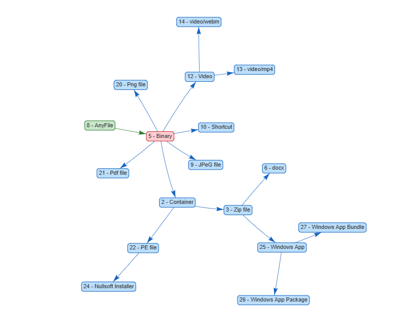
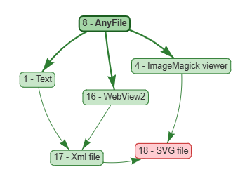
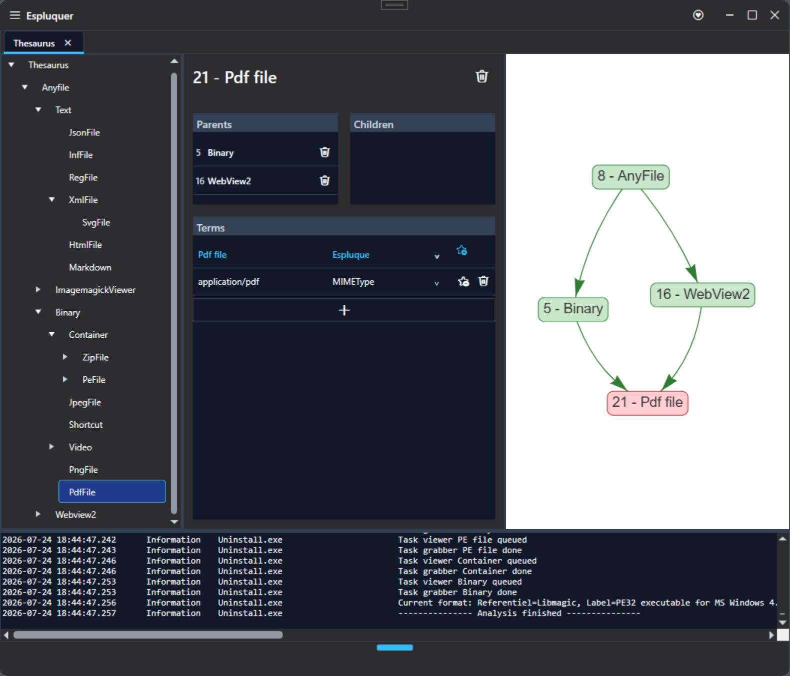
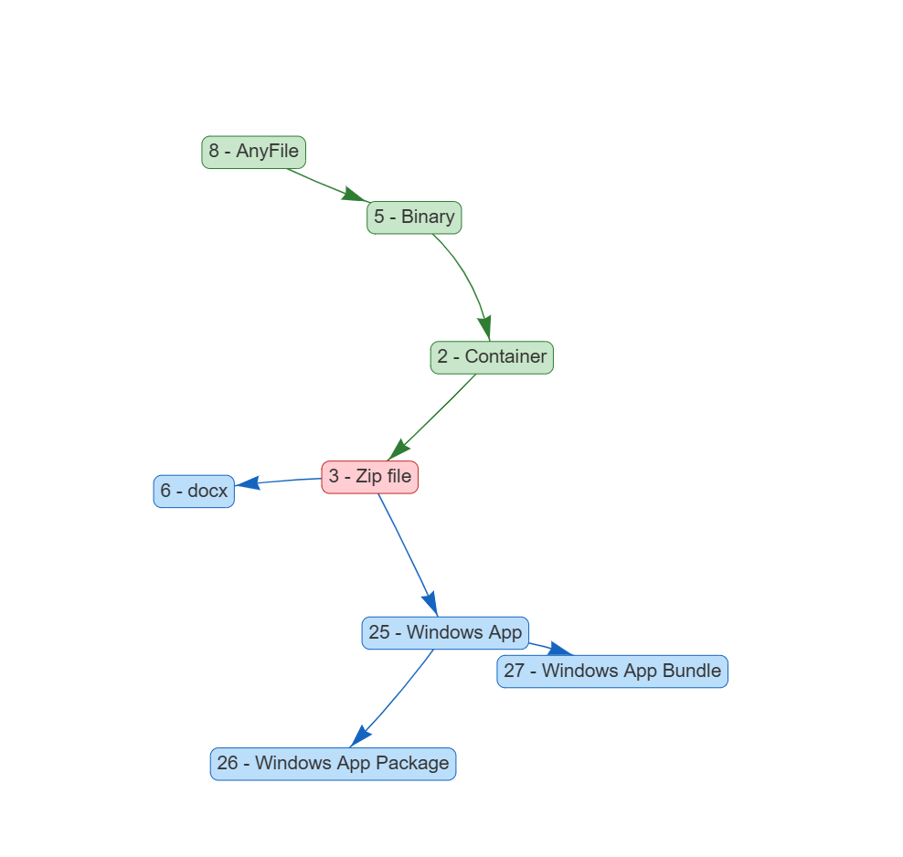
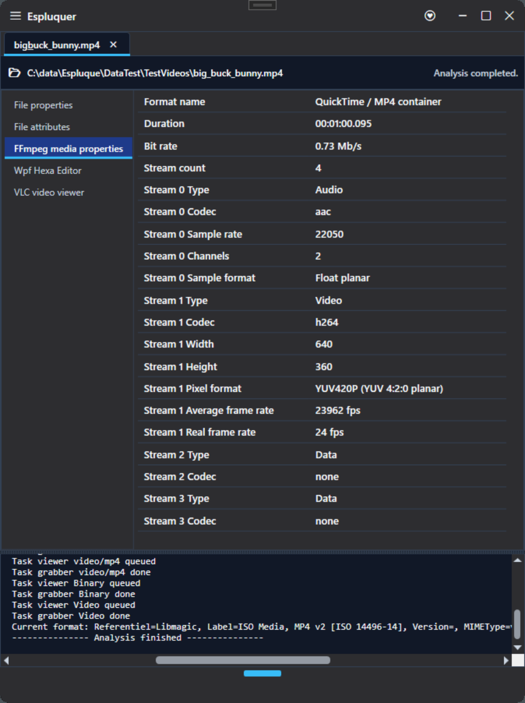
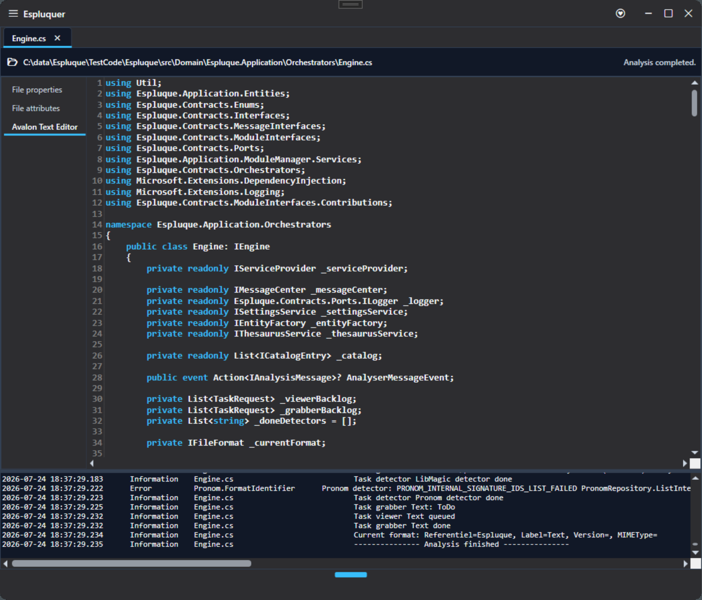
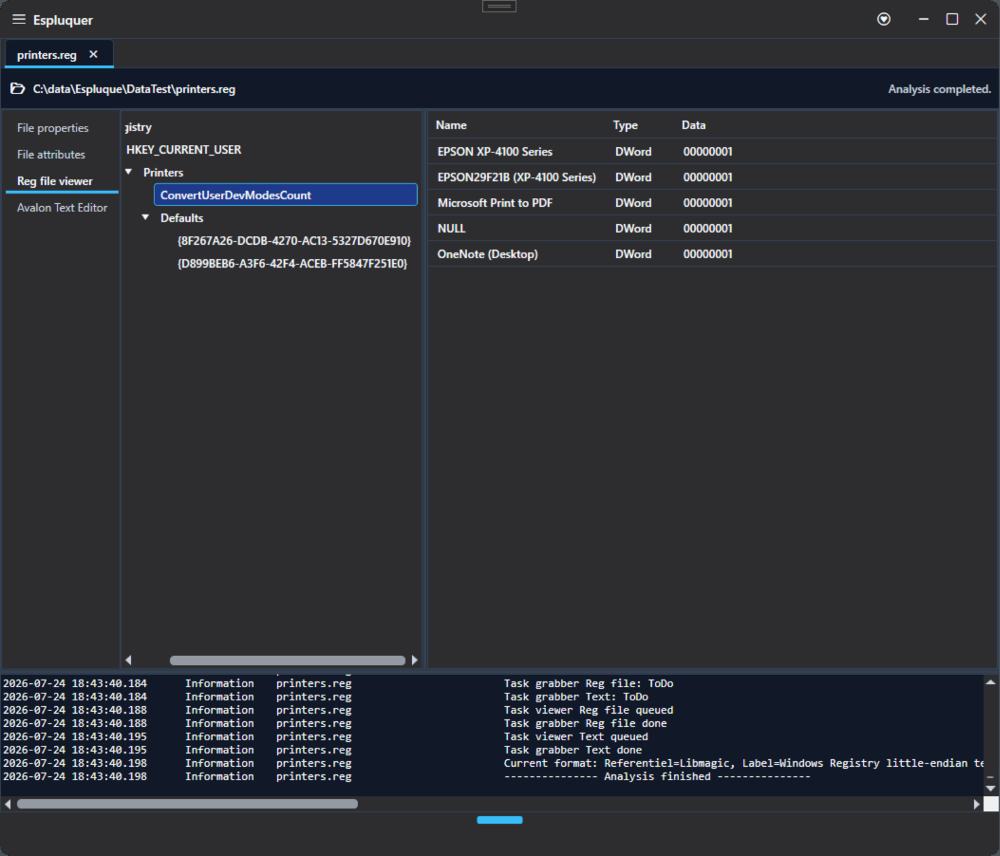
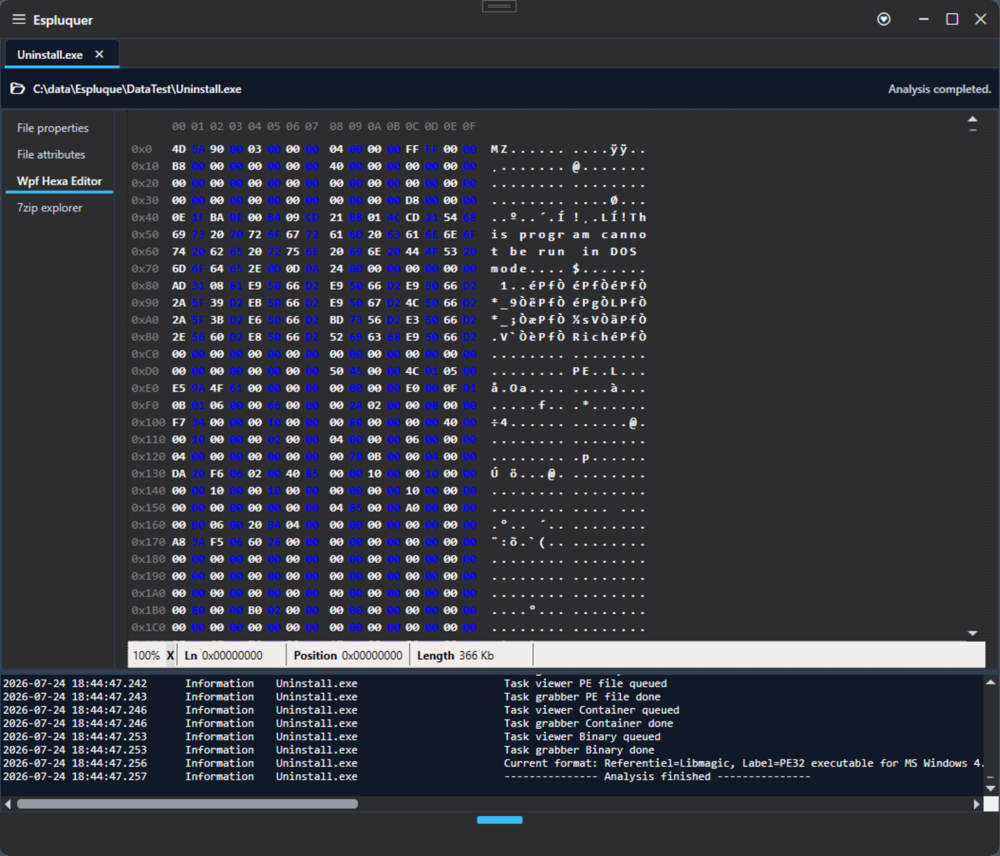
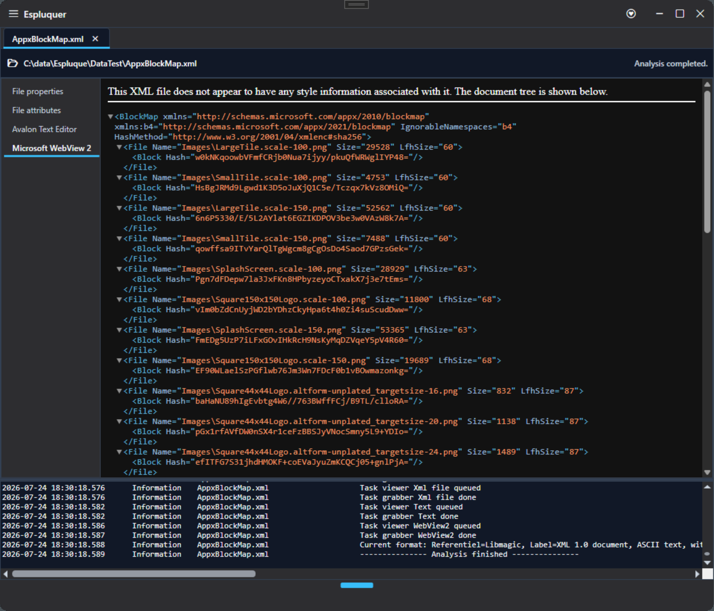

[Documentation](../README.md) · [User quick start](quick-start.md) · [User how-to](how-to.md) · **User concepts**

# Thesaurus concepts

The Espluque engine is driven by a thesaurus made of concepts connected through parent-child relationships.

Each concept can provide three kinds of contributions:

* detectors;
* grabbers;
* viewers.

## Concepts and relationships

A concept represents a type, format or characteristic that may apply to a file.

Concepts are connected to more general parent concepts and more specific child concepts.

When the engine reaches a concept, its position in this graph determines which contributions are activated.

## More than a hierarchy

The thesaurus is not a simple tree.

A concept can have several parents, allowing the same file characteristic to belong to several classification paths.

It also supports:

- synonyms, for several terms referring to the same concept;
- homonyms, for identical terms referring to different concepts;
- several vocabularies or reference systems.

This allows detectors using different terminologies, such as libmagic, PRONOM or MIME type, to map their results to the same underlying concepts.

## User-controlled behavior

The thesaurus can be modified directly by the user.

Concepts, relationships and contribution tags determine which detectors, grabbers and viewers are activated during an analysis.

By editing these elements, the user can change how Espluque interprets files and which module contributions are executed, without modifying the application or the modules themselves.

## Detectors

Detectors determine whether a more specific concept applies to the analyzed file.

When the engine is on a concept:

1. all detectors attached directly to that concept are executed,
2. if the concept has no detector, the engine searches its descendants,
3. the nearest child concept containing one or more detectors is selected,
4. its detectors are executed.

Detectors are therefore used to continue the analysis toward more specific concepts.

## Grabbers

Grabbers extract information from the file.

When the engine reaches a concept, it executes:

* the grabbers attached to that concept;
* the grabbers attached to all its parent concepts.

Each grabber is executed only once during an analysis, even when it is reached through several concepts or relationships.

The extracted information is displayed as property lists in a property file tab.

## Viewers

Viewers provide a visual representation of the analyzed file or of one of its detected characteristics.

When the engine reaches a concept, it queues:

* the viewers attached to that concept;
* the viewers attached to all its parent concepts.

Queued viewers are created after the analysis is complete.

|                                                    |                                                  |
| -------------------------------------------------- | ------------------------------------------------ |
|  |  |
|  |  |

---

[Documentation home](../README.md) · [Previous: User how-to](how-to.md)
