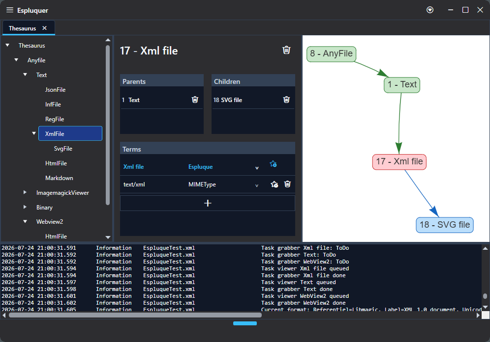
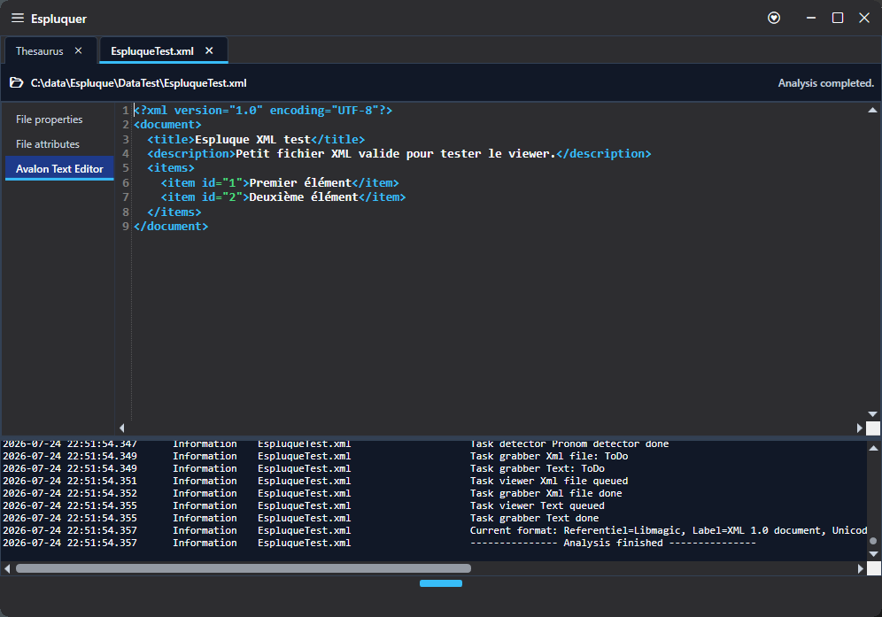
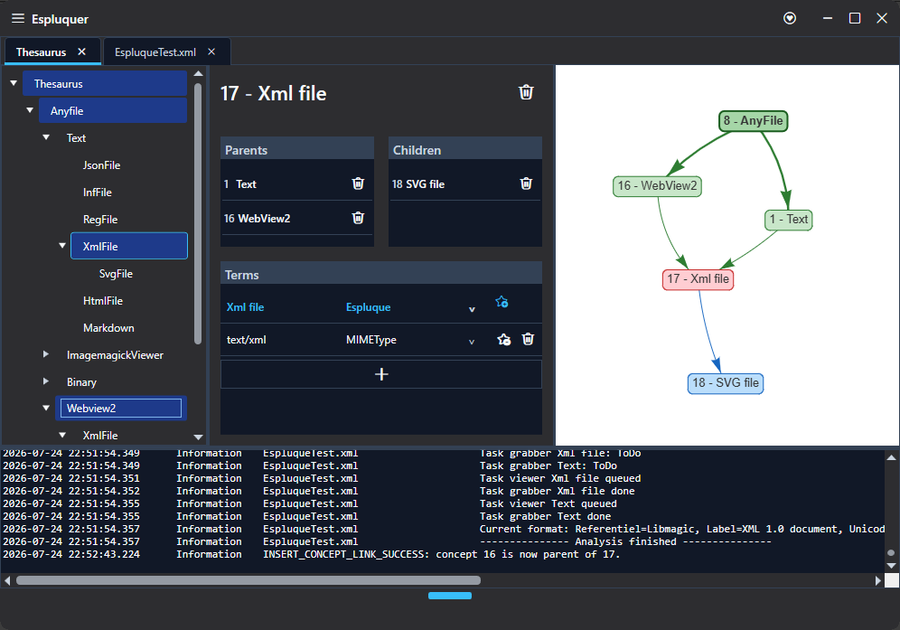
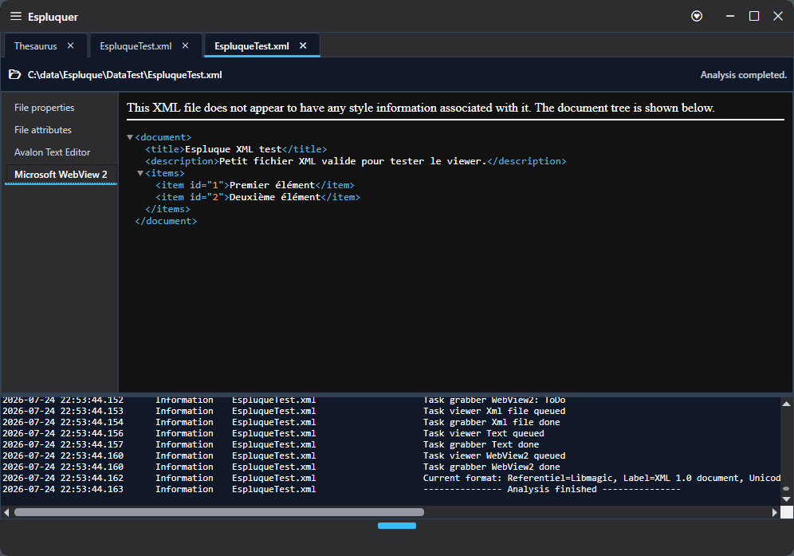
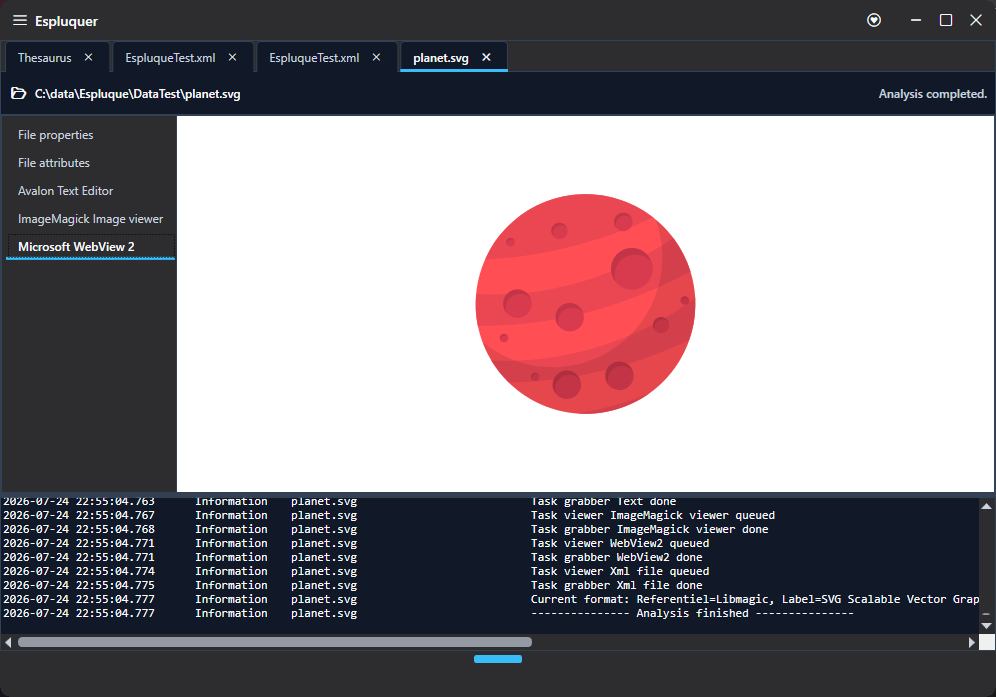
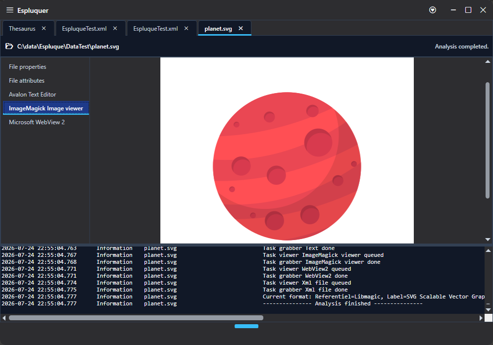
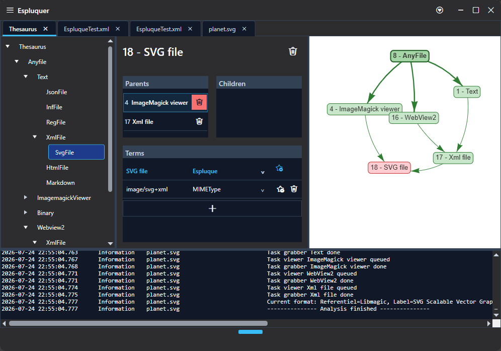
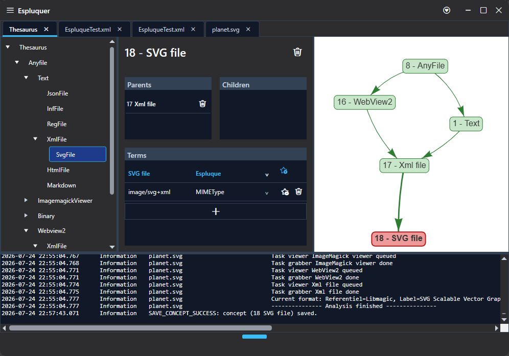
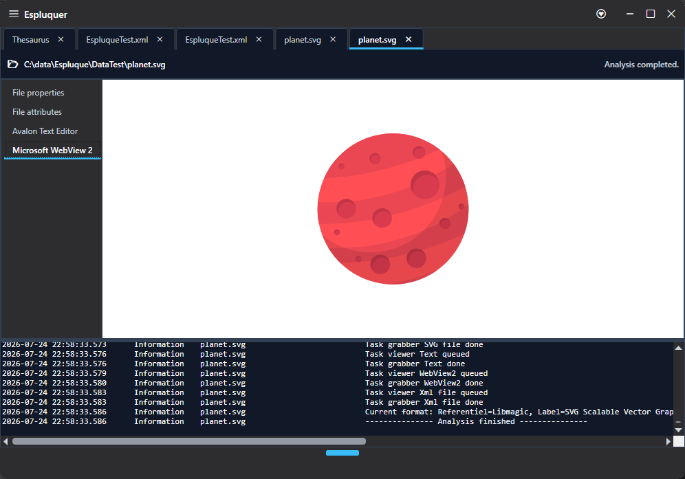

[Documentation](../README.md) · [User quick start](quick-start.md) · **User how-to** · [User concepts](concepts.md)

# How to

## Link/Unlink a file format to/from a viewer

|                                                                        |                                                                                                                                                                                                                         |
| ---------------------------------------------------------------------- | ----------------------------------------------------------------------------------------------------------------------------------------------------------------------------------------------------------------------- |
|         | We start with a thesaurus where "XMLFile" is a child of "Text", which is itself a child of "AnyFile", and a parent of "SVGFile".                                                                                        |
|                  | Analyzing a file detected as "XML" displays the properties associated with "AnyFile", as well as the AvalonEdit viewer associated with "Text". At this stage, no viewer is associated directly with XML.                |
|                    | Return to the thesaurus. In the left tree, drag and drop "XMLFile" onto "WebView2". "XMLFile" then also becomes a child of "WebView2". Note that this also affects the children of "XMLFile", including "SVGFile" here. |
|                 | Analyzing an XML file now also activates the viewer associated with "WebView2".                                                                                                                                         |
|         | Analyzing an SVG file also activates the viewer associated with "WebView2".                                                                                                                                             |
|      | Another viewer, ImageMagick, is also associated with SVG. We will disable this viewer for files identified as "SVGFile".                                                                                                |
|  | Select "SVGFile" in the left tree. Then, in the central panel, click the trash icon in the Parents section to remove the relationship between "SVGFile" and "ImageMagick viewer".                                       |
|             | "SVGFile" now has only one parent: "XMLFile".                                                                                                                                                                           |
|                 | Analyzing an SVG file no longer activates the ImageMagick viewer. As a child of "XMLFile", it still activates the "WebView2" viewer.                                                                                    |

---

[Documentation home](../README.md) · [Previous: User quick start](quick-start.md) · [Next: User concepts](concepts.md)
